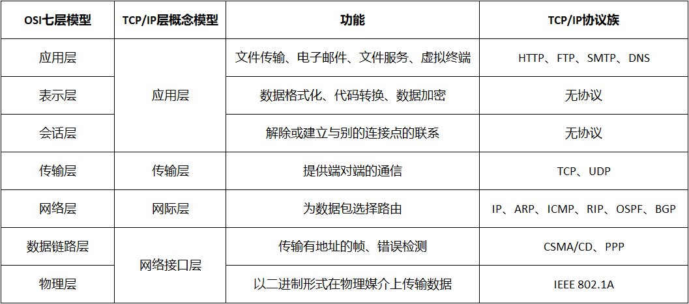
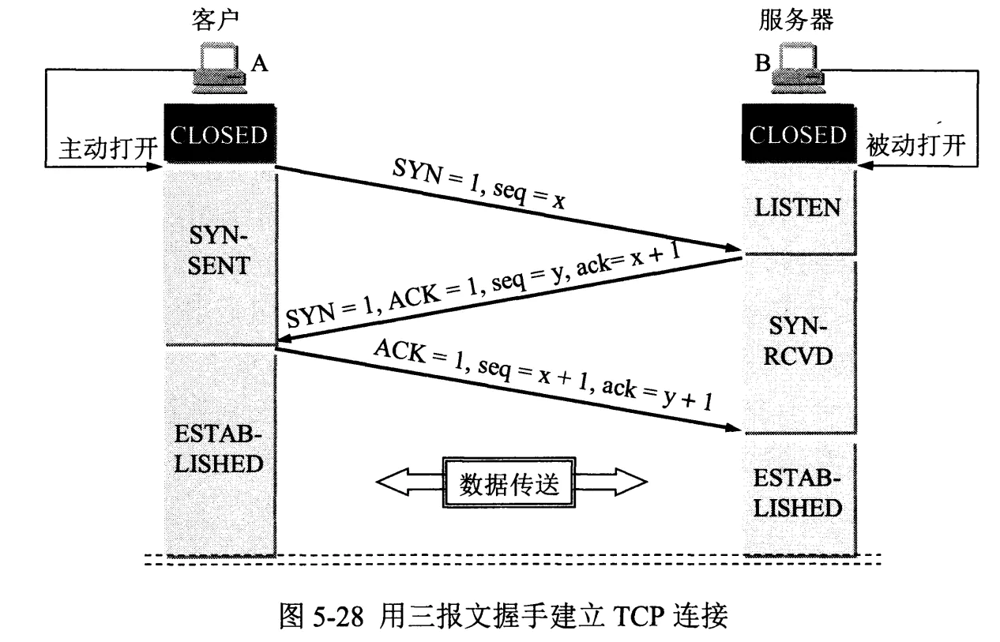
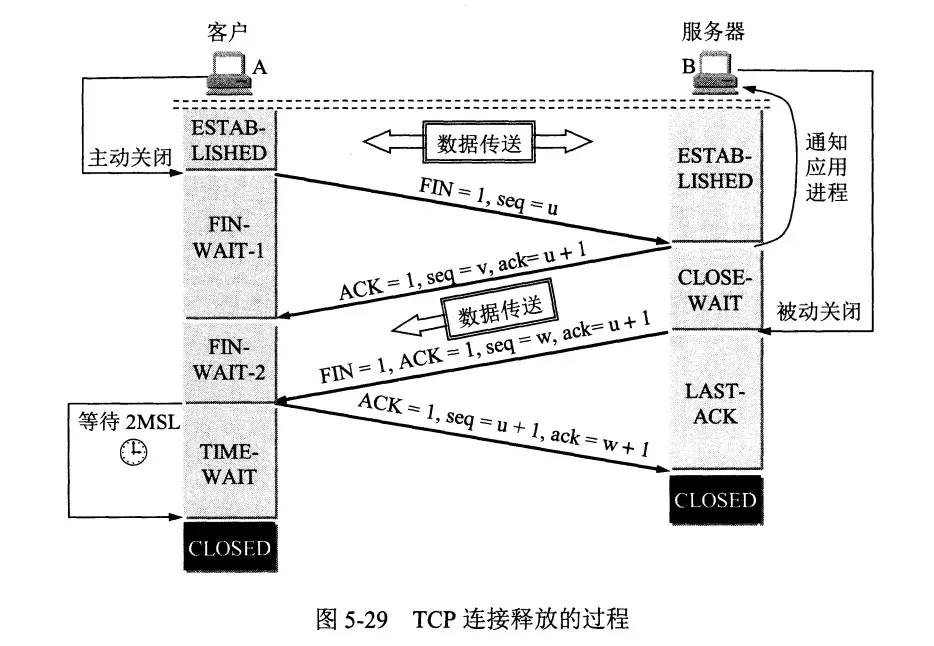
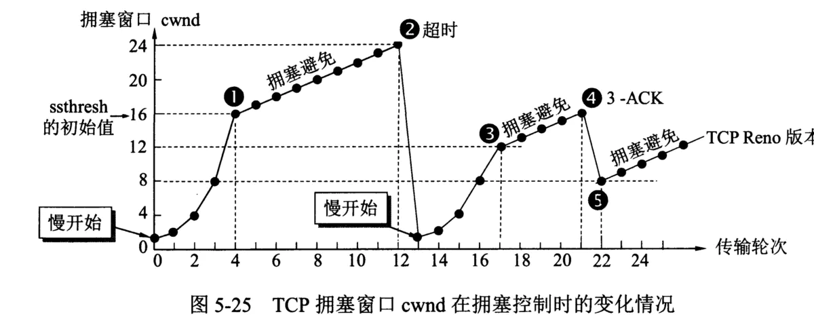

# 一、计算机网络体系结构



# 二、IP

## ARP协议

ARP (Address Resolution Protocol)，即地址解析协议，可以根据IP地址获取物理地址：
- 主机将包含目标IP地址的ARP请求广播到局域网的所有主机，并接收返回信息，以此确定目标主机的物理地址
- 收到返回信息后将该IP地址和物理地址存入本机ARP缓存中，下次请求时可以直接查询ARP缓存

# 三、TCP

- 面向连接的、可靠的、基于字节流的传输层通信协议
- 将应用层的数据流分割成报文段并发送给目标节点的TCP层
- 数据包有序号，对方收到则发送ACK确认，未收到则重传
- 使用校验和来检验数据在传输过程中是否有误
- 使用**超时重传机制**来实现可靠传输，如果一个已经发送的报文段在超时时间内没有收到确认，那么就重传这个报文段

## 1. 三次握手



### 首次握手隐患

- **SYN Flood**：服务端收到客户端的SYN，回复SYN-ACK的时候未收到ACK确认，服务端会不断重试直到超时（Linux默认等待63秒才断开连接）
- **措施**：SYN队列满后，服务端通过`tcp_syncookies`参数回发SYN Cookie，若为正常连接则客户端会回发SYN Cookie直到建立连接

### 三次握手原因
为了初始化双方的序列号

### 如何保持连接

- 服务端向客户端发送保活探测报文，如果未收到响应则继续发送
- 尝试次数达到保活探测数仍未收到响应则中断连接

## 2. 四次挥手



### 四次挥手原因

TCP是全双工通信，发送发和接收方都需要发送和接受FIN报文、ACK报文

### TIME_WAIT状态

- 确保有足够的时间让对方收到ACK包
- 避免新旧连接混淆

### CLOSE_WAIT状态

- **服务器出现大量CLOSE_WAIT状态原因**：对方关闭socket，我方忙于读或写，没有及时关闭连接

- **措施**：检查释放资源的代码、检查处理请求的线程配置

## 3. 流量控制 

- 流量控制是为了控制发送方发送速率，保证接收方来得及接收
- 接收方发送的确认报文中的窗口字段可以用来控制发送方窗口大小，从而影响发送方的发送速率

## 4. 拥塞控制



- 慢开始与拥塞避免
- 快重传与快恢复

## 5. 粘包

### 发送方产生粘包

当发送的数据包过小时，TCP协议默认会启用Nagle算法，将这些较小的数据包进行合并发送。


### 接收方产生粘包

数据包会暂存在接收方的接收缓冲区中，当接收数据的速度大于应用层取数据的速度时，前一个数据包还没有来得及读取，下一个数据包又被放入了缓冲区，这时读取数据就会读取到粘连在一起的数据包。


### 解决方法

- 消息定长：发送端将每个数据包封装为固定长度的包，接收端每次接收缓冲区中读取固定长度的数据。
- 设置消息边界：服务端从网络流中按消息边界分离出消息内容，例如在包尾增加回车换行符进行分割。
- 将消息分为消息头和消息体，消息头中包含表示消息总长度的字段。
  


# 四、UDP

- 不维护连接状态，支持一对多、多对多通信
- 尽最大努力交付，不保证可靠传输
- 面向报文，不对应用程序提交的报文信息进行拆分和合并
- 数据包报头只有8个字节，额外开销小，吞吐量只受限于数据生成速率、传输速率及机器性能

## 1. UDP与TCP区别

- 无连接 / 面向连接
- 不可靠 / 可靠
- 无序 / 有序
- 速度快 / 速度慢

# 五、HTTP

## 1. 请求和响应的流程

- 客户端与服务器建立TCP连接
- 客户端发送HTTP请求
- 服务端接收请求并返回HTTP响应
- 客户端释放TCP连接
- 客户端浏览器解析HTML内容

## 2. 状态码

| 状态码 | 类型       | 含义                       |
| ------ | ---------- | :------------------------- |
| 1xx    | 指示信息   | 接收的请求正在处理         |
| 2xx    | 成功       | 请求正常处理完毕           |
| 3xx    | 重定向     | 需要进行附加操作以完成请求 |
| 4xx    | 客户端错误 | 请求有语法错误或无法实现   |
| 5xx    | 服务器错误 | 服务器处理请求出错         |

## 3. 连接管理

- **短连接**
每进行一次 HTTP 通信就要新建一个TCP连接。HTTP/1.1 之前默认是短连接，开启长连接需要在header中设置 `Connection : Keep-Alive`

- **长连接**
建立一次 TCP 连接可以进行多次 HTTP 通信。HTTP/1.1 开始默认是长连接，要断开连接需要由客户端或者服务器端提出断开，使用 `Connection : close`

- **流水线**
可以在同一条长连接上连续发出HTTP请求，而不用等待响应返回。HTTP/1.1 开始支持流水线。


## 4. GET和POST的区别

- GET只能将请求信息放在URL中，POST可以将请求信息放在请求体中
- GET符合幂等性和安全性，POST不符合
- GET可以被缓存，POST不可以

## 5. Cookie和Session的区别

- Cookie是由服务器发送给客户端的特殊信息，以文本的形式存放在客户端
  客户端再次请求的时候，会把Cookie回发
  服务器收到后，会解析Cookie生成与客户端对应的内容
- Session是服务端的机制，在服务器上保存信息
  解析客户端请求并操作session id，按需保存状态信息

## 6. 跨域

浏览器不能执行其他网站来源的脚本，这是由浏览器的同源策略造成的，同源是指协议、域名、端口均相同。

可以使用以下方法解决：

- JSONP (JSON with Padding)
创建`<script>`标签，利用`<script>`标签的`src`属性可以获取任何域下的`script`
只支持GET请求，不支持POST请求

- CORS
在服务器增加如下响应头的一种或几种：
```http
Access-Control-Allow-Origin: *
Access-Control-Allow-Methods: POST, GET, OPTIONS
Access-Control-Allow-Headers: X-PINGOTHER, Content-Type
Access-Control-Max-Age: 86400
```

- 代理
同源策略是针对浏览器端进行的限制，可以通过服务器端来解决。
例如客户端浏览器A需要请求另一个域B，可以让服务器作为代理，去请求域B，然后将响应结果返回给客户端A。

# 六、HTTPS

## 1. HTTP和HTTPS的区别

- HTTP使用明文传输，HTTPS需要到CA申请证书，使用密文传输，更加安全
- HTTP默认使用80端口，HTTPS使用443端口

## 2. HTTPS的加密过程


# 七、Socket

Socket是对TCP/IP协议的抽象，是操作系统对外开放的接口，可以实现不同主机之间的进程的双向通信。


## 1. Socket通信流程


## 2. Socket编程

编写一个网络应用程序，包含客户端和服务端，用TCP和UDP两种方式实现：

- 客户端向服务端发送一个字符串
- 服务端接收到该字符串后将其输出到命令行，然后向客户端返回字符串的长度
- 客户端在命令行输出服务端返回的长度

### TCP实现

```java
// 服务端
import java.io.IOException;
import java.net.ServerSocket;
import java.net.Socket;

public class TCPServer {
    public static void main(String[] args) throws IOException {
        // 创建socket，并绑定到65000端口
        ServerSocket ss = new ServerSocket(65000);
        // 一直等待并处理客户端发送过来的请求
        while (true) {
            // 监听65000端口，直到客户端返回连接信息
            Socket socket = ss.accept();
            // 获取客户端的请求信息，执行业务逻辑
            new LengthCalculator(socket).start();
        }
    }
}

class LengthCalculator extends Thread {
    private Socket socket;

    public LengthCalculator(Socket socket) {
        this.socket = socket;
    }

    @Override
    public void run() {
        try {
            // 获取socket的输出流
            OutputStream out = socket.getOutputStream();
            // 获取socket的输入流
            InputStream in = socket.getInputStream();
            // 缓存输入内容
            byte[] buffer = new byte[1024];
            // 输入内容的长度
            int ch = in.read(buffer);

            // 将输入流的byte数组转成字符串，打印到控制台
            String content = new String(buffer, 0, ch);
            System.out.println(content);
            // 往输入流里写入获得的字符串的长度，发送给客户端
            out.write(String.valueOf(content.length()).getBytes());

            // 关闭输入输出流和socket
            in.close();
            out.close();
            socket.close();
        }
        catch (IOException e) {
            e.printStackTrace();
        }
    }
}
```

```java
// 客户端
import java.io.IOException;
import java.io.InputStream;
import java.io.OutputStream;
import java.net.Socket;

public class TCPClient {
    public static void main(String[] args) throws IOException {
        // 创建socket，连接到本机的65000端口
        Socket socket = new Socket("127.0.0.1", 65000);
        // 获取输入流
        InputStream in = socket.getInputStream();
        // 获取输出流
        OutputStream out = socket.getOutputStream();

        // 将要传递给服务端的字符串转换成byte数组，发送给服务端
        out.write(new String("Hello world!").getBytes());

        // 缓存输入内容
        byte[] buffer = new byte[1024];
        // 输入内容的长度
        int ch = in.read(buffer);

        // 从服务端发回的字符串的长度
        String content = new String(buffer, 0, ch);
        System.out.println(content);

        in.close();
        out.close();
        socket.close();
    }
}
```

### UDP实现

```java
// 服务端
import java.net.DatagramPacket;
import java.net.DatagramSocket;

public class UDPServer {
    public static void main(String[] args) throws Exception {
        // 监听端口号65001
        DatagramSocket socket = new DatagramSocket(65001);
        // 将客户端发送的内容封装进DatagramPacket对象中
        byte[] buffer = new byte[100];
        DatagramPacket packet = new DatagramPacket(buffer, buffer.length);
        
        // 接收客户端发送的内容
        socket.receive(packet);
        // 将获取到的数据转成字符串，打印到控制台
        byte[] data = packet.getData();
        String content = new String(data, 0, packet.getLength());
        System.out.println(content);

        // 从packet对象中获取数据的来源地址和端口号，给客户端发送数据
        byte[] sendContent = String.valueOf(content.length()).getBytes();
        DatagramPacket sendPacket = new DatagramPacket(sendContent,
                sendContent.length, packet.getAddress(), packet.getPort());
        socket.send(sendPacket);
    }
}
```

```java
// 客户端
import java.net.DatagramPacket;
import java.net.DatagramSocket;
import java.net.InetAddress;

public class UDPClient {
    public static void main(String[] args) throws Exception{
        DatagramSocket socket = new DatagramSocket();
        // 封装数据报
        byte[] buffer = "Hello world!".getBytes();
        DatagramPacket packet = new DatagramPacket(buffer, buffer.length,
                InetAddress.getByName("127.0.0.1"), 65001);
        // 发送数据给服务端
        socket.send(packet);

        // 客户端接收从服务端发送过来的数据
        byte[] data = new byte[100];
        // 将接收到的数据存储到DatagramPacket对象中
        DatagramPacket receivedPacket = new DatagramPacket(data, data.length);
        socket.receive(receivedPacket);
        // 将接收到的数据打印到控制台
        String content = new String(receivedPacket.getData(), 0, receivedPacket.getLength());
        System.out.println(content);
    }
}
```

# 八、WebSocket

WebSocket是一个可以实现客户端与服务器全双工通信的**应用层**协议。客户端可以主动向服务器发送信息，服务器也可以主动向客户端推送信息。客户端与服务端通过HTTP进行握手，建立连接后，双方使用TCP推送数据。

