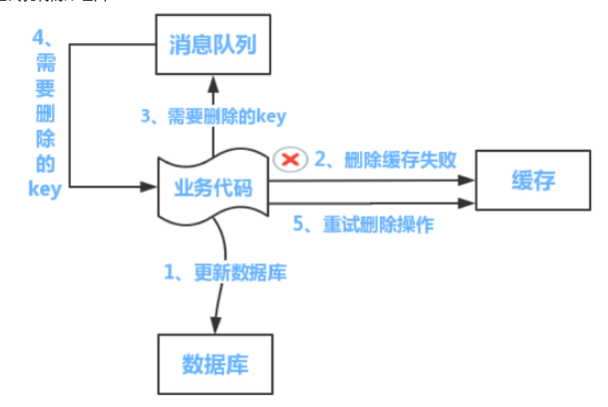

### 如何保证缓存和数据库的双写一致性

最经典的缓存+数据库读写的模式，就是 Cache Aside Pattern。

- 读的时候，先读缓存，缓存没有的话，就读数据库，然后取出数据后放入缓存，同时返回响应。
- 更新的时候，**先更新数据库，然后再删除缓存**。



# 自我介绍

我叫xxx，来自苏州大学计算机科学与技术专业

我对于数据库、操作系统、计算机网络、设计模式等专业课有较为深入的认识

可以熟练使用Java和Python，熟悉Java I/O、多线程与网络编程，熟悉前端的常用技术

我参与过多个软件开发项目，熟悉软件开发部署的一般流程。

# 项目介绍

## 1. 校园电商平台二次开发

如何保证可用性？参考字节提前批的第二次面试经历整理，非常重要！！！

[聊天系统架构设计](https://zhuanlan.zhihu.com/p/37284519)

[Netty 入门与实战：仿写微信 IM 即时通讯系统](https://juejin.im/book/5b4bc28bf265da0f60130116/section/5b6a1a9cf265da0f87595521)

### 自定义通信协议

作用：减小数据包大小，提供数据传输效率


### 粘包问题

应用层是按照 ByteBuf 为 单位来发送数据，但是到了底层操作系统仍然是按照字节流发送数据，因此，数据到了服务端，也是按照字节流的方式读入，然后到了 Netty 应用层面，重新拼装成 ByteBuf，而这里的 ByteBuf 与客户端按顺序发送的 ByteBuf 可能是不对等的。

解决方案：

- 根据自定义协议计算数据包大小，使用基于长度域拆包器 LengthFieldBasedFrameDecoder进行拆包

- 通过判断魔数，拒绝非本协议连接

### 性能优化

对于耗时的操作，我们需要把这些耗时的操作丢到我们的业务线程池中去处理，这样就可以避免一些耗时的操作影响 Netty 的 NIO 线程，从而影响其他的 channel.

```java
ThreadPool threadPool = xxx;

protected void channelRead0(ChannelHandlerContext ctx, T packet) {
    threadPool.submit(new Runnable() {
        // 1. balabala 一些逻辑
        // 2. 数据库或者网络等一些耗时的操作
        // 3. writeAndFlush()
        // 4. balabala 其他的逻辑
    })
}
```

### 心跳与空闲检测

接假死的现象是指在某一端（服务端或者客户端）看来，底层的 TCP 连接已经断开了，但是应用程序并没有捕获到，因此会认为这条连接仍然是存在的。

1. 要处理假死问题首先我们要实现客户端与服务端定期发送心跳，在这里，其实服务端只需要对客户端的定时心跳包进行回复。
2. 客户端与服务端如果都需要检测假死，那么直接在 pipeline 的最前方插入一个自定义 `IdleStateHandler`，在 `channelIdle()` 方法里面自定义连接假死之后的逻辑。
3. 通常空闲检测时间要比发送心跳的时间的两倍要长一些，这也是为了排除偶发的公网抖动，防止误判。

## 2. 宿舍汇校园电商平台

项目包括后端接口、后台管理系统、微信小程序三个部分，整体采用REST架构。使用token构建用户授权体系，采用AOP实现接口的访问权限控制，前端带上token访问后端API，后端收到请求后验证token访问数据库并返回json响应。

### 基于Token构建用户授权体系

token存储在服务端的缓存中，token过期后，客户端需要重新申请。


### 下单与支付流程

- 客户端调用下单接口，向服务端提交所选择商品的信息
- 服务端对订单相关商品进行**库存量检测<sup>1</sup>**，有库存则将订单数据存入数据库，并通知客户端可以发起支付
- 客户端调用服务端的支付接口进行支付
- 服务端**进行库存量检测**<sup>2</sup>，调用微信支付的接口发起支付
- 微信服务器给服务端返回支付成功的消息，**进行库存量检测<sup>3</sup>**，通过则进行**库存量扣除**


### 优化页面加载速度

服务器带宽小(1Mbps)，多图页面加载速度慢

**解决方案：**

- **客户端缓存页面数据**
  访问页面时尝试从本地缓存中加载页面数据，否则向服务器请求数据。

- **服务端动静分离**

 

配置nginx实现动静分离，对静态请求直接返回所需的静态资源（`*.html *.css *.js` 图片等等）
对静态资源开启文件压缩，文本文件的压缩率较高；但图片的压缩率不佳，将图片迁移到七牛云CDN.

```nginx
# 配置文件示例
server {
    listen 			80;
    server_name:	xxx.xxx.xxx.xxx;	
    
    # 开启sendfile
    sendfile on;
    
    location ~ .*\.(jpg|gif|png)$ {
        # 开启文件压缩，gzip算法对文本文件的压缩性能更好
        gzip on;
        gzip_http_version 1.1;
        # 文件压缩等级
        gzip_comp_level 2;
        # 压缩文件类型
        gzip_types image/jpg image/gif image/png;
        # 图片存储路径
        root	xxxx;
    }
}
```

### 负载均衡

### 遇到的问题

分库分表、多表联合查询

数据库的负载均衡和微服务的负载均衡

如何使用Redis设计一个秒杀功能？恶意秒杀如何解决？